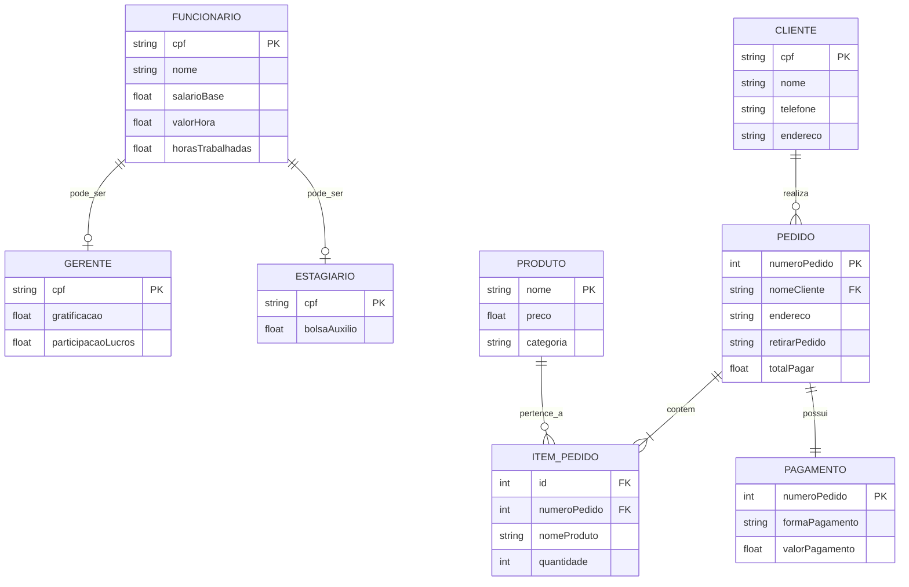

# ☕ Coffee Time
Projeto A3 - Site para uma loja fisica e delivery de Cafés com doces e salgados como acompanhamento.
* Site: [Link](https://paulaj2023.github.io/Coffee_Time/)
* Administração: [Link](https://paulaj2023.github.io/Coffee_Time/admin.html) 
---
# 📑 Sobre o Projeto
O **Coffee Time** é uma plataforma completa para uma loja fisica e delivery especializada em cafés especiais com salgados e doces artesanais. A plataforma conecta clientes, funcionários e administradores, centralizando o gerenciamento de pedidos, pagamentos e avaliações em um único lugar.

Professores: Edjane Mikaelly Silva de Azevedo

---
# 👥 Desenvolvedores

* Paula Jordania do Nascimento de Lima -
Curso: Ciência da Computação - UNP Campus Salgado Filho - Turno: Manhã

 * Maria Eduarda Rodrigues Gonçalves -
Curso: ADS - UNP Campus Salgado Filho - Turno: Manhã

---
#  👥 Perfis dos usuários

## Cliente 👤
* Cadastrar e Logar
* Adiciona produtos ao carrinho e simula os valores.
* Realiza pedidos preenchendo informações como nome, forma de pagamento e tipo de entrega (Delivery ou Retirada no Balcão).
* Acompanha o status dos seus pedidos

## Funcionários / Membros Ativos 👥
* Gerente: Perfil com maior nível de acesso na gestão.
* Barista: Responsável pelo preparo dos cafés e produtos.
* Estagiária: Perfil de suporte à equipe.

## Administrador 🛠️
* Gerencia Funcionarios
* Controlar pedidos
* Administrar a plataforma
* Painel de Acessibilidade (UI/IHC)
* Modo Escuro
* Listagem e Filtro de Pedidos
* Controle de Progresso
* Dashboard de Métricas
* Cadastro de Equipe
* Gerador de Token (Exportação)

---
# Funcionalidades Principais ⚙️
* Login Inteligente:
* Cadastro com Validação
* Carrinho de Compras
* Formulário Adaptável

---
# Requísitos Aplicados 📋
* Uso de nove classes
* Criação de objetos
* Atributos e métodos
* Encapsulamento
* Herança
* Polimorfismo
* Cadastro, listagem e consulta de dados
* Organização do código

---
# 🧩 Entidades do Sistema

|Tipo de Entidade             | Classe no Código Java | Justificativa                                                            |
| --------------------------- | --------------------- | ------------------------------------------------------------------------ |
| `/Entidade Forte`           | Funcionario / Cliente | Possuem identificadores próprios (CPF) e existem de forma autónoma       |
| `/Entidade Fraca`           | Gerente / Estagiario  | Dependem logicamente e estruturalmente da classe Funcionario (Herança)   |
| `/Entidade Associativa`     | Pedido                | Une os dados do fluxo de venda (Cliente + Produtos + Valores do momento) |

# 🔗 Relacionamentos

## 🔹 One-to-One

* Pedido ➔ Pagamento

## 🔹 One-to-Many

* Cliente ➔ Pedido

## 🔹 Many-to-Many

* Pedido ➔ Produtos

---

# 🛠️ Tecnologias Utilizadas

## Back-end

* Java SE
* Java Swing
* Java AWT

## Integração de Dados

* Web LocalStorage (API do Navegador)
* Java Collections (ArrayList)
* Clipboard Data Transfer (Mecanismo de Integração)

## Front-end

* HTML
* CSS
* JavaScript
* Font Awesome

---

# 🏗️ Modelo de Dados com localStorage e ArrayList

Nosso código código não possui um banco de dados relacional físico configurado (como MySQL ou PostgreSQL). Em vez disso, usamos o localStorage no navegador e ArrayList na memória do Java para guardar as informações. No entanto, estruturalmente, nosso programa possui sim um Modelo de Dados Implícito. As nossas classes Java e os objetos criados no JavaScript foram desenhados com atributos que se conectam exatamente como tabelas de um banco de dados.


---
# 📦 Endpoints Principais (Simulação da API REST do Coffee Time) ☕

Esta seção documenta como a estrutura de dados atual do Coffee Time (HTML/JS + Java Swing) seria mapeada em uma API RESTful para comunicação com um servidor backend.

## 🔓 Público

### Buscar Informações do Cardápio
```http
GET /produtos
```

## 🔑 Autenticação

```http
POST /auth/login
```

### Request

```json
{
  "email": "eduarda@coffeetime.com",
  "senha": "duda123"
}
```

### Response

```json
{
  "autenticado": true,
  "usuario": "Eduarda",
  "perfil": "ADMINISTRADOR",
  "token": "token_sessao_coffee_time_jwt"
}
```

---

## 👤 Clientes

```http
GET /clientes
POST /clientes
```

```json
{
  "nome": "Paula",
  "cpf": "123.456.789-00",
  "telefone": "84999999999",
  "endereco": "Lagoa Nova, Natal - RN",
  "detalhesPagamento": "Pix",
  "valorPagamento": 0.0
}
```

---

## 🛠️ Gestão de Funcionários

```http
GET /funcionarios
DELETE /funcionarios/{cpf}
```

Cadastrar Funcionário Comum / Barista
```http
POST /funcionarios/comum
```

```json
{
  "nome": "Lucas Ribeiro",
  "cpf": "111.222.333-44",
  "salarioBase": 2200.00,
  "valorHora": 0.0,
  "horasTrabalhadas": 0.0
}
```

Cadastrar Gerente
```http
POST /funcionarios/gerente
```

```json
{
  "nome": "Eduarda Pereira",
  "cpf": "555.666.777-88",
  "salarioBase": 4500.00,
  "valorHora": 0.0,
  "horasTrabalhadas": 0.0,
  "gratificacao": 800.00,
  "participacaoLucros": 500.00
}
```

Cadastrar Estagiário
```http
POST /funcionarios/estagiario
```

```json
{
  "nome": "Julia Costa",
  "cpf": "999.888.777-66",
  "salarioBase": 0.0,
  "valorHora": 0.0,
  "horasTrabalhadas": 0.0,
  "bolsaAuxilio": 1200.00
}
```

##☕ Pedidos e Delivery

```http
GET /pedidos
GET /pedidos/{numeroPedido}
```


---

## Criar Novo Pedido da Loja

```http
POST /pedidos
```

```json
{
  "numeroPedido": 4829,
  "nomeCliente": "Paula Jordânia",
  "endereco": "Lagoa Nova, Natal - RN",
  "produtosSelecionados": "2x Café Espresso, 1x Cookie Chocolate, 1x Bolo de Cenoura",
  "formaPagamento": "Pix",
  "retirarPedido": "Delivery",
  "totalPagar": 21.50
}

{
  "status": "Sucesso",
  "mensagem": "🎉 Pedido enviado para a cozinha com sucesso! Acompanhe no Painel Admin.",
  "codigoPedido": "#4829"
}
```
---

---
